# Lea Finck Einsendeaufgabe DVC-E1

## 1: Repository erstellen
Repository wurde auf GitHub erstellt und auf public gesetzt.

## 2: Projekt hochladen
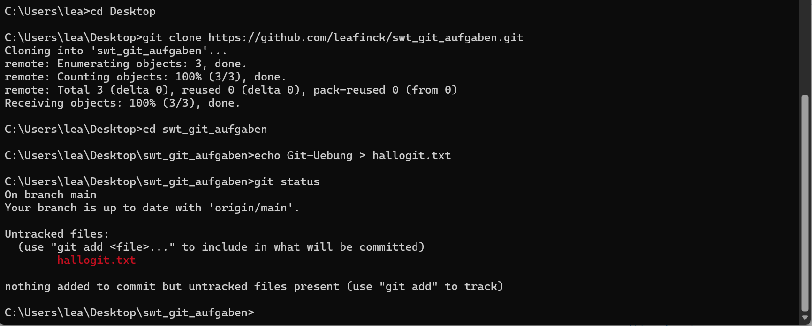

## 3: Git-Befehle
### git help
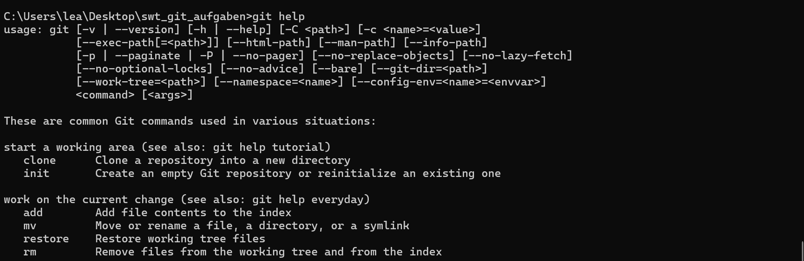

### git add & status
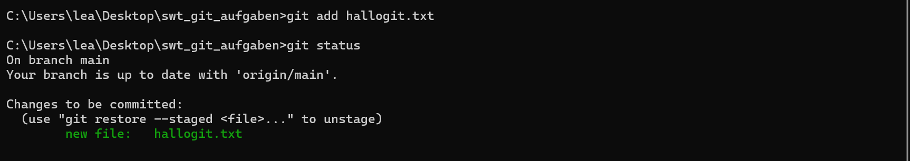

### git diff
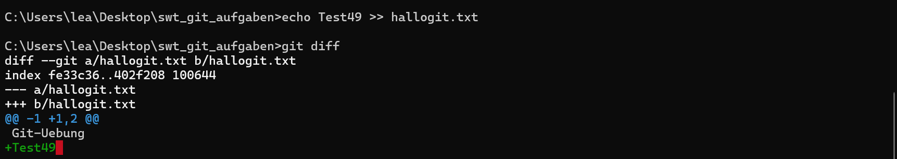

### git commit
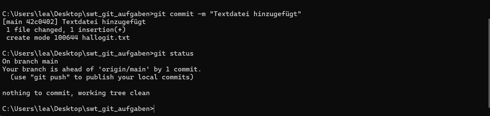

### git rm & push
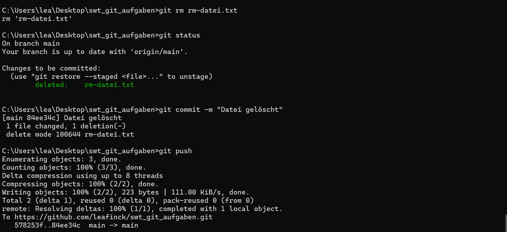

### git pull

### git mv
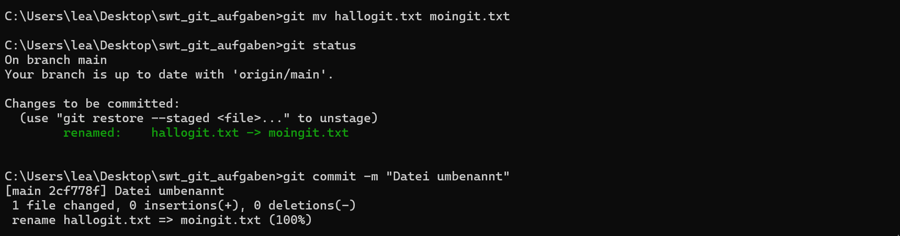

### git log
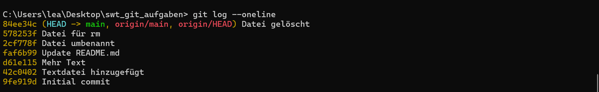

## 4: Zeitreisen
### git revert
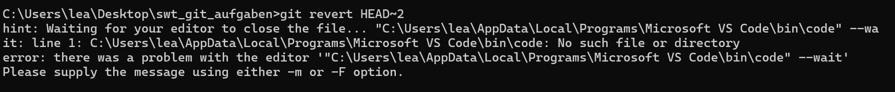
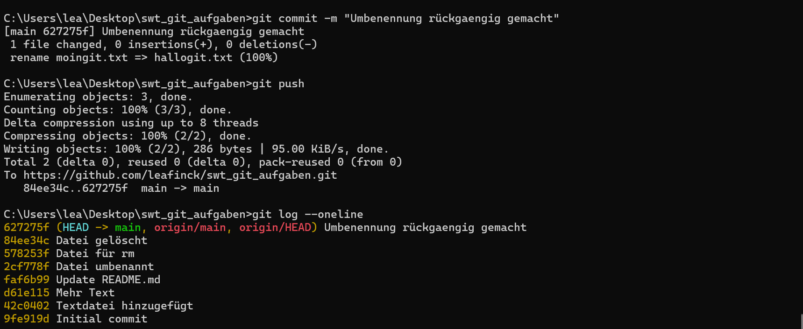

### git reset
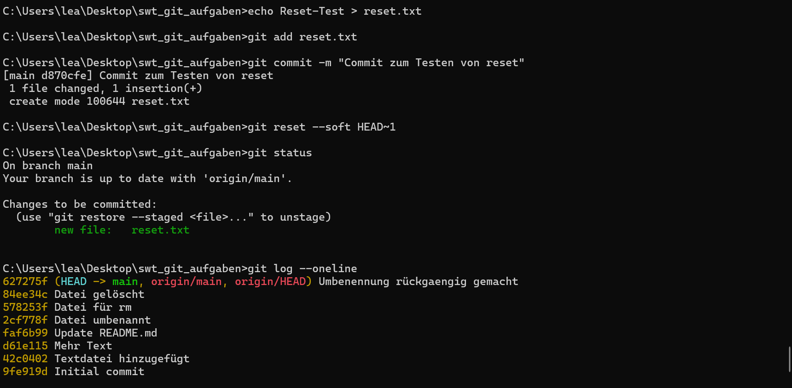

## 5: Branches git checkout, merge, branch -d
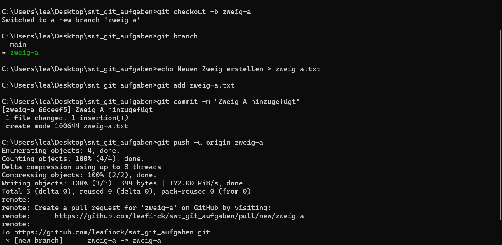
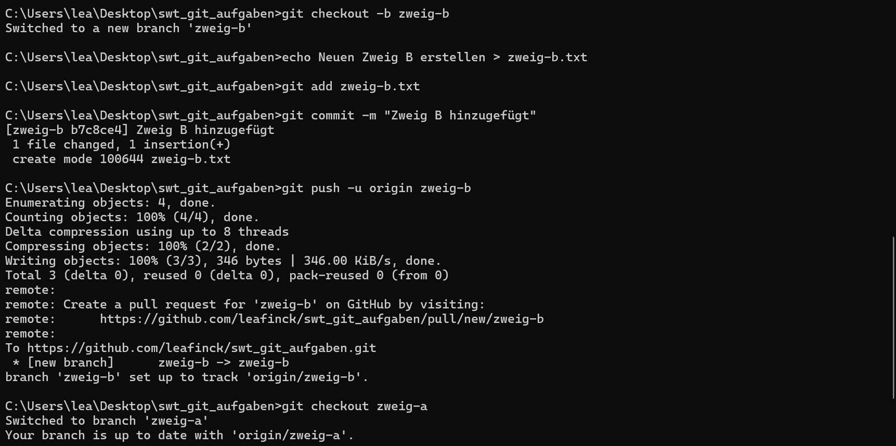

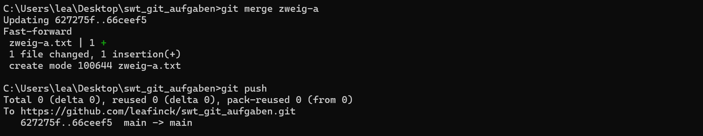
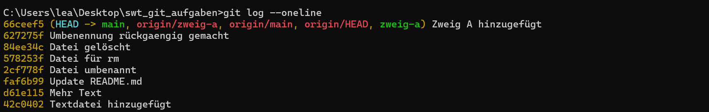

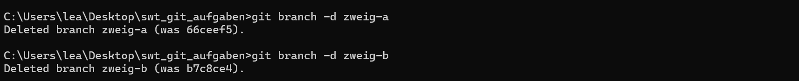

## 6: Pull-Request
Pull-Request #616: [[LINK](https://github.com/edlich/education/pull/616)]
